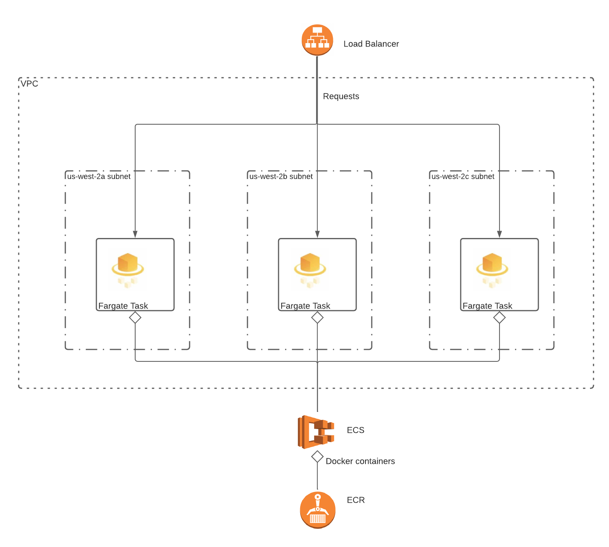

# Terraform : Docker on AWS

This repo demonstrates how to deploy a Docker image on AWS via Terraform. Make sure you have both [Terraform](https://www.terraform.io/) and the [AWS CLI](https://docs.aws.amazon.com/cli/latest/userguide/getting-started-install.html) installed.

The infrastructure defined in this repo uses the [Elastic Container Service](https://aws.amazon.com/ecs/) to deploy Docker containers on [Fargate](https://aws.amazon.com/fargate/). ECS can also be configured to deploy the containers on EC2. Reference the [ECS application architecture](https://docs.aws.amazon.com/AmazonECS/latest/developerguide/application_architecture.html) to understand the tradeoffs between Fargate / EC2.

## Setup and Cleanup
Set up the infrastructure.
```bash
terraform apply
```

Tear down the infrastructure.
```bash
terraform destroy
```

## Docker Setup
ECS exposes port 5000 on deployed containers. To use this repo in its current configuration, make sure you are serving your application on port 5000, and have added the following code to your Dockerfile.

```bash
EXPOSE 5000
```

After setting up the infrastructure, you'll need to publish your Docker image to the [Elastic Container Registry](https://aws.amazon.com/ecr/). Within the ECR section of the AWS Console, click the repo `my-first-ecr-repo` and **View push commands**. Use those commands to push the image to ECR.

## Networking
ECS deploys Fargate services within the AWS default VPC. Fargate services are deployed in three different availability zones - `us-west-2a`, `us-west-2b`, and `us-west-2c`. Each availability zone is assigned a different default subnet. The load balancer routes requests to the three Fargate services - the Fargate services are targets of the load balancer target group.

ECS creates a *task*, and assigns that *task* to *services*. In the `aws_ecs_task_definition` resource you'll notice that the container definition includes a link to the ECR repository. The ECS task pulls the latest image from the ECR repository, and deploys that image on Fargate.

## Architecture
* ECR - Elastic Container Registry
* ECS - Elastic Container Service

